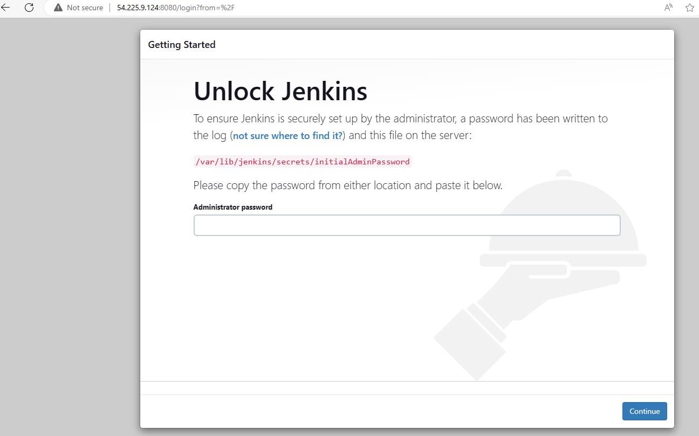
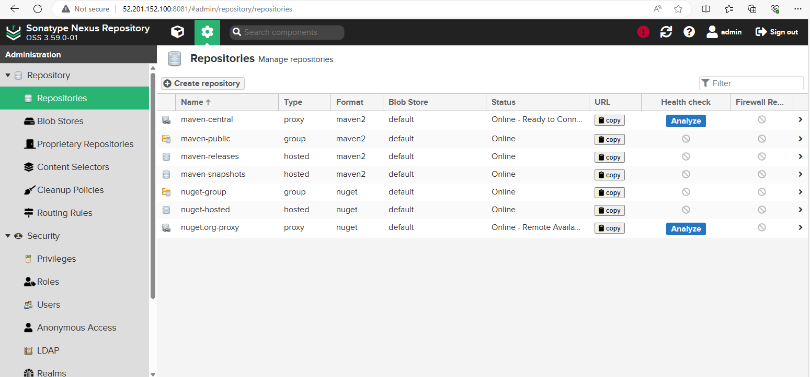
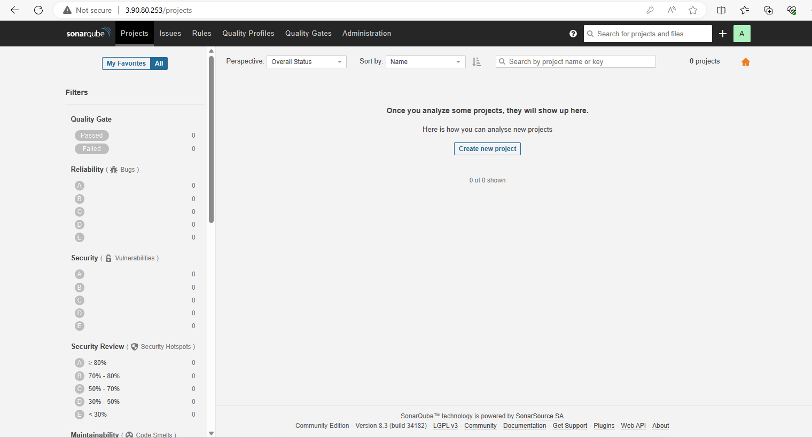
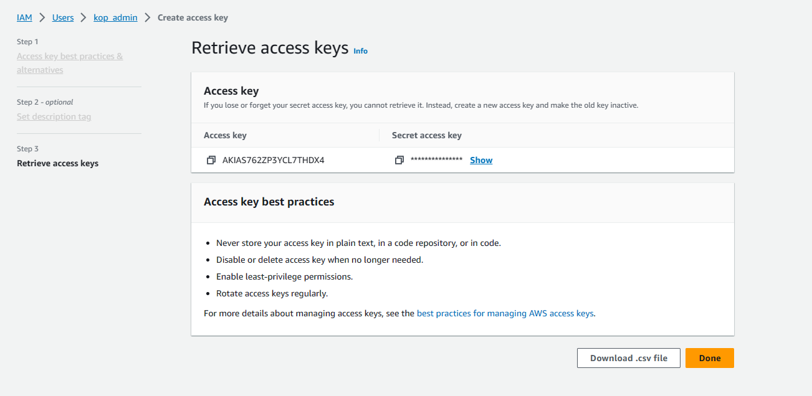
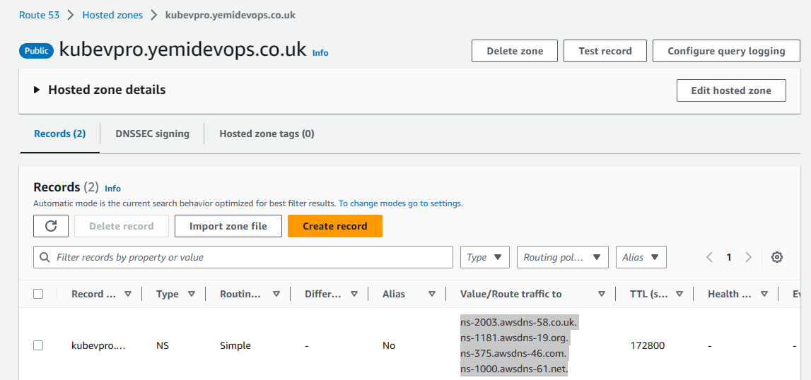
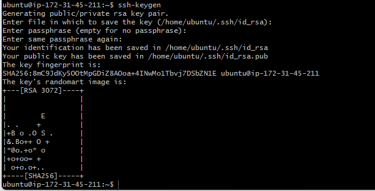
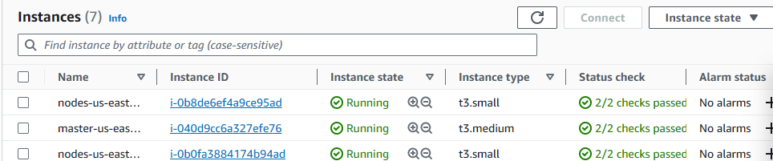
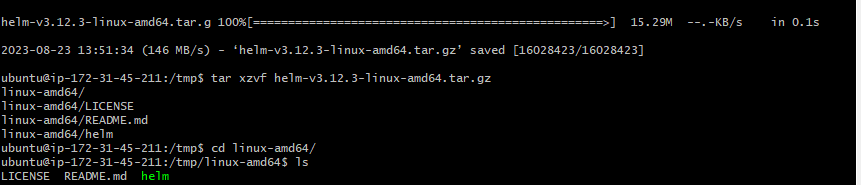
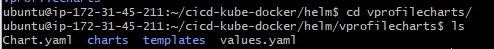
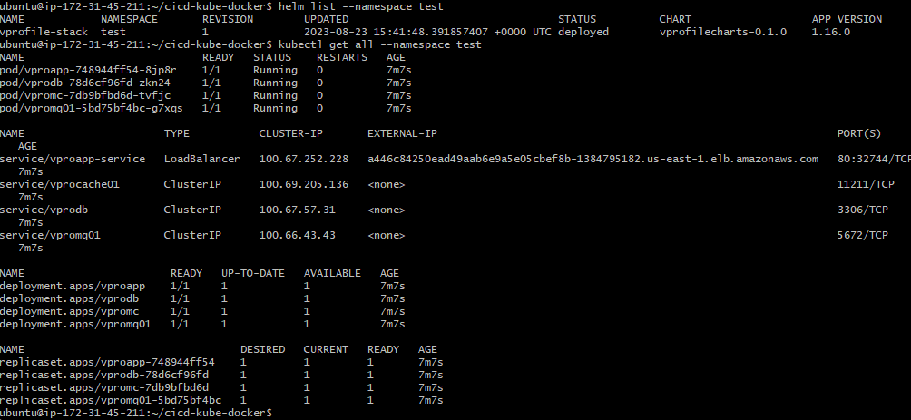

# Project-17: CICD For Docker Kubernetes using Jenkins

[*Project Source*](https://www.udemy.com/course/decodingdevops/learn/lecture/32413216#overview)


## Pre-requisites:
- Kubernetes - As containers orchestration tool.
- Docker - To build and test docker images.
- Jenkins - As CI/CD Server.
- Docker Hub - To host docker images.
- Helm - For packaging and deploying images to Kubernetes cluster.
- Git - As version Control System.
- Maven - To build java code.
- SonarQube - For code analysis.

## Step-1: Log into AWS account and Create Key Pair
- Create a keypair and download the private key to your local system. We will need this key to ssh into our servers.

## Step-2: Create Security Groups for Jenkins, Nexus and SonarQube

# Jenkins Security Group
- Configure inbound rule to allow ssh login on port 22 and Allow Jenkins on port 8080 from anywhere. We will be updating the Jenkins security group rule to allow traffic on port 8080 via the Sonarqube security group.
```sh
Name: jenkins-SG
Allow: SSH from MyIP on port 22
Allow: 8080 from Anywhere
```
# Nexus Security Group
- Configure inbound rule to allow ssh login on port 22, also configure port 8081 to be accessible from the browser and port 8081 from the the configured Jenkins-SG.
```sh
Name: Nexus-SG
Allow: SSH on port 22 from MyIP
Allow: 8081 from MyIP and Jenkins-SG
```
# SonarQube Security Group
- Configure the inbound rule allow SSH on port 22, allow access from My IP on port 80 and also from the configure Jenkins-SG
```sh
Name: SonarQube-SG
Allow: SSH from MyIP
Allow: 80 from MyIP and Jenkins-SG
```

- Once SonarQube-SG is created edit Jenkins-SG inbound rule to allow traffic from Sonarqube security group. This allows for Sonarqube send results back to our Jenkins server.

## Step-3: Create EC2 instances for Kops, Jenkins, Nexus and SonarQube

# Kops Server Setup
- Launch an Ec2 instance with the details below
```sh
Name: Kops
AMI: Ubuntu 22.04
SecGrp: kops-sg
Ingress: Port 22 allowed from "my IP" or "anywhere"
InstanceType: t2.micro
KeyPair: kops-key.pem
```

# Jenkins Server Setup
- Create `Jenkins-server` with below properties and userdata script.
```sh
Name: jenkins-server
AMI: Ubuntu 20.04
SecGrp: jenkins-SG
InstanceType: t2.small
KeyPair: jenkins-Key
Additional Details: userdata below
```

- Jenkins userdata
```sh
#!/bin/bash
sudo apt update

sudo apt install openjdk-11-jdk -y
 
curl -fsSL https://pkg.jenkins.io/debian-stable/jenkins.io-2023.key | sudo tee \
  /usr/share/keyrings/jenkins-keyring.asc > /dev/null
 
echo deb [signed-by=/usr/share/keyrings/jenkins-keyring.asc] \
  https://pkg.jenkins.io/debian-stable binary/ | sudo tee \
  /etc/apt/sources.list.d/jenkins.list > /dev/null
 
sudo apt-get update
 
sudo apt-get install jenkins -y

###
```
# Nexus Server Setup

- Create `Nexus-server` with below properties and userdata script.
```sh
Name: nexus-server
AMI: centos7
InstanceType: t2.medium
SecGrp: nexus-SG
KeyPair: NexusKey 
Additional Details: userdata below
```
- userdata
```sh
#!/bin/bash
sudo yum install java-1.8.0-openjdk.x86_64 wget -y   
mkdir -p /opt/nexus/   
mkdir -p /tmp/nexus/                           
cd /tmp/nexus/
NEXUSURL="https://download.sonatype.com/nexus/3/latest-unix.tar.gz"
wget $NEXUSURL -O nexus.tar.gz
EXTOUT=`tar xzvf nexus.tar.gz`
NEXUSDIR=`echo $EXTOUT | cut -d '/' -f1`
rm -rf /tmp/nexus/nexus.tar.gz
rsync -avzh /tmp/nexus/ /opt/nexus/
sudo useradd nexus
sudo chown -R nexus.nexus /opt/nexus 
cat <<EOT>> /etc/systemd/system/nexus.service
[Unit]                                                                          
Description=nexus service                                                       
After=network.target                                                            
                                                                  
[Service]                                                                       
Type=forking                                                                    
LimitNOFILE=65536                                                               
ExecStart=/opt/nexus/$NEXUSDIR/bin/nexus start                                  
ExecStop=/opt/nexus/$NEXUSDIR/bin/nexus stop                                    
User=nexus                                                                      
Restart=on-abort                                                                
                                                                  
[Install]                                                                       
WantedBy=multi-user.target                                                      
EOT
echo 'run_as_user="nexus"' > /opt/nexus/$NEXUSDIR/bin/nexus.rc
sudo systemctl daemon-reload
sudo systemctl start nexus
sudo systemctl enable nexus
```

# Sonar Server Setup
- Create `sonar-server` with below properties and userdata script.
```sh
Name: Sonar-server
AMI: Ubuntu 20.04
InstanceType: t2.medium
SecGrp: Sonar-SG
KeyPair: sonarkey
Additional Details: userdata below
```
- Sonar Userdata script
```sh
#!/bin/bash
sudo cp /etc/sysctl.conf /root/sysctl.conf_backup
cat <<EOT> /etc/sysctl.conf
vm.max_map_count=262144
fs.file-max=65536
ulimit -n 65536
ulimit -u 4096
EOT
sudo cp /etc/security/limits.conf /root/sec_limit.conf_backup
cat <<EOT> /etc/security/limits.conf
sonarqube   -   nofile   65536
sonarqube   -   nproc    409
EOT
sudo apt-get update -y
sudo apt-get install openjdk-11-jre -y
sudo update-alternatives --config java
#java -version
sudo apt update -y
wget -q https://www.postgresql.org/media/keys/ACCC4CF8.asc -O - | sudo apt-key add -
sudo sh -c 'echo "deb http://apt.postgresql.org/pub/repos/apt/ `lsb_release -cs`-pgdg main" >> /etc/apt/sources.list.d/pgdg.list'
sudo apt install postgresql postgresql-contrib -y
#sudo -u postgres psql -c "SELECT version();"
sudo systemctl enable postgresql.service
sudo systemctl start  postgresql.service
sudo echo "postgres:admin123" | chpasswd
runuser -l postgres -c "createuser sonar"
sudo -i -u postgres psql -c "ALTER USER sonar WITH ENCRYPTED PASSWORD 'admin123';"
sudo -i -u postgres psql -c "CREATE DATABASE sonarqube OWNER sonar;"
sudo -i -u postgres psql -c "GRANT ALL PRIVILEGES ON DATABASE sonarqube to sonar;"
systemctl restart  postgresql
#systemctl status -l   postgresql
netstat -tulpena | grep postgres
sudo mkdir -p /sonarqube/
cd /sonarqube/
sudo curl -O https://binaries.sonarsource.com/Distribution/sonarqube/sonarqube-8.3.0.34182.zip
sudo apt-get install zip -y
sudo unzip -o sonarqube-8.3.0.34182.zip -d /opt/
sudo mv /opt/sonarqube-8.3.0.34182/ /opt/sonarqube
sudo groupadd sonar
sudo useradd -c "SonarQube - User" -d /opt/sonarqube/ -g sonar sonar
sudo chown sonar:sonar /opt/sonarqube/ -R
sudo cp /opt/sonarqube/conf/sonar.properties /root/sonar.properties_backup
cat <<EOT> /opt/sonarqube/conf/sonar.properties
sonar.jdbc.username=sonar
sonar.jdbc.password=admin123
sonar.jdbc.url=jdbc:postgresql://localhost/sonarqube
sonar.web.host=0.0.0.0
sonar.web.port=9000
sonar.web.javaAdditionalOpts=-server
sonar.search.javaOpts=-Xmx512m -Xms512m -XX:+HeapDumpOnOutOfMemoryError
sonar.log.level=INFO
sonar.path.logs=logs
EOT
cat <<EOT> /etc/systemd/system/sonarqube.service
[Unit]
Description=SonarQube service
After=syslog.target network.target
[Service]
Type=forking
ExecStart=/opt/sonarqube/bin/linux-x86-64/sonar.sh start
ExecStop=/opt/sonarqube/bin/linux-x86-64/sonar.sh stop
User=sonar
Group=sonar
Restart=always
LimitNOFILE=65536
LimitNPROC=4096
[Install]
WantedBy=multi-user.target
EOT
sudo systemctl daemon-reload
sudo systemctl enable sonarqube.service
#systemctl start sonarqube.service
#systemctl status -l sonarqube.service
sudo apt-get install nginx -y
sudo rm -rf /etc/nginx/sites-enabled/default
sudo rm -rf /etc/nginx/sites-available/default
cat <<EOT> /etc/nginx/sites-available/sonarqube
server{
    listen      80;
    server_name sonarqube.groophy.in;
    access_log  /var/log/nginx/sonar.access.log;
    error_log   /var/log/nginx/sonar.error.log;
    proxy_buffers 16 64k;
    proxy_buffer_size 128k;
    location / {
        proxy_pass  http://127.0.0.1:9000;
        proxy_next_upstream error timeout invalid_header http_500 http_502 http_503 http_504;
        proxy_redirect off;
              
        proxy_set_header    Host            \$host;
        proxy_set_header    X-Real-IP       \$remote_addr;
        proxy_set_header    X-Forwarded-For \$proxy_add_x_forwarded_for;
        proxy_set_header    X-Forwarded-Proto http;
    }
}
EOT
sudo ln -s /etc/nginx/sites-available/sonarqube /etc/nginx/sites-enabled/sonarqube
sudo systemctl enable nginx.service
#systemctl restart nginx.service
sudo ufw allow 80,9000,9001/tcp
echo "System reboot in 30 sec"
sleep 30
reboot
```

## Step-4: Post Installation Steps

# For Jenkins Server:
- We need to SSH our jenkins server and check system status for Jenkins. Then we will get initialAdmin password from directory `/var/lib/jenkins/secrets/initialAdminPassword`
```sh
sudo -i
systemctl status jenkins
cat /var/lib/jenkins/secrets/initialAdminPassword
```
- Go to browser, http://<public_ip_of_jenkins_server>:8080, enter initialAdminPassword and install suggested plugins. Then create your first admin user.


# For Nexus Server:
- SSH into nexus server and check system status for nexus.
```sh
sudo -i
systemctl status nexus
```

- Go to browser, http://<public_ip_of_nexus_server>:8081 , click on sign-in. Initial password will be located `/opt/nexus/sonatype-work/nexus3/admin.password`
```sh
cat /opt/nexus/sonatype-work/nexus3/admin.password
```
- Username is `admin`, paste password from previous step. Setup our new password and select `Disable Anonymous Access`.


# For SonarQube Server:
- Go to browser, http://<public_ip_of_sonar_server>.
- Login with username `admin` and password `admin`.


- Generate new token from SonarQube and install the Sonarqube plugin on jenkins


 - Copy the token that was generated earlier, go to `jenkins server` using port 8080 then `manage jenkins`→ `system` → and add Sonarqube server there


- In jenkins file we have a stage to push our image to docker hub, so get docker hub credentials and store that details in jenkins as done for Sonarqube:
- Go to `manage jenkins` → `credentials` → system → add credentials


# For Kops Server:
- Create an S3 bucket with details below to store the state of Kops so we can run our Kops command from anywhere as long as it is pointed to our s3 bucket.
```sh
Bucketname: vprofile-kops-state26
```


- Create an IAM user for our awscli with details below:
```sh
Username: Kops_admin
Attach policies: Adminstrator Access
(Be sure to download the csv file)
```



- Create Hosted Zone in Route53 with details below
```sh
Domain Name: kubevpro.<yourdomain-name.com>
```
- Add the Nameserver URL to your domain registry.



- Now that we have our `IAM user`, `S3 bucket` and `Domain` setup, we can login and configure our `ec2` instance.
- Log in to your `ec2` instance and generate ssh-key which would be used by our Kops.
- Install and configure `aws cli` with commands below

```sh
sudo apt update && sudo apt install awscli -y
aws configure
then add the aws access key and secret key you already created and downloaded alongside your ec2 instance region.
Output "Json"
```


- Next, Install and setup Kubectl with commands from the documentation link here `https://kubernetes.io/docs/tasks/tools/install-kubectl-linux/`
```sh
curl -LO "https://dl.k8s.io/release/$(curl -L -s https://dl.k8s.io/release/stable.txt)/bin/linux/amd64/kubectl"
chmod +x ./kubectl
sudo mv kubectl /usr/local/bin/
```
- Next, install Kubernetes with Kops with documentation link here `https://github.com/kubernetes/kops/releases`. Navigate to `v1.26.4` > `Assets` > `kops-linux-amd64`, then right click to copy the link.
```sh
wget https://github.com/kubernetes/kops/releases/download/v1.26.4/kops-linux-amd64
ls
chmod +x kops-linux-amd64
sudo mv kops-linux-amd64 /usr/local/bin/kops
kops
```
- Verify Domain with the command below
```sh
nslookup -type=ns kubevpro.<yourdomain-name.com>
```


## Step-5: Install docker engine in jenkins server

- SSH into the `jenkins server` and install the docker engine using the commands below gotten from docker engine installation website
```sh
sudo apt-get update
sudo apt-get install ca-certificates curl gnupg
sudo install -m 0755 -d /etc/apt/keyrings
curl -fsSL https://download.docker.com/linux/ubuntu/gpg | sudo gpg --dearmor -o /etc/apt/keyrings/docker.gpg
sudo chmod a+r /etc/apt/keyrings/docker.gpg

echo \
  "deb [arch="$(dpkg --print-architecture)" signed-by=/etc/apt/keyrings/docker.gpg] https://download.docker.com/linux/ubuntu \
  "$(. /etc/os-release && echo "$VERSION_CODENAME")" stable" | \
  sudo tee /etc/apt/sources.list.d/docker.list > /dev/null

sudo apt-get update
sudo apt-get install docker-ce docker-ce-cli containerd.io docker-buildx-plugin docker-compose-plugin
sudo docker run hello-world
```


- The reason docker was installed in jenkins server is that we will run docker build command from jenkins server, for this add jenkins user in docker group, then reboot the instance once.
```sh
usermod -aG docker jenkins
id jenkins
su - jenkins
docker images
reboot
```


## Step-6: Install Plugins in jenkins server and create Kubernetes clusters from Kops

- Install plugins below for Jenkins.
```sh
Docker
Docker Pipeline
Pipeline utility steps
```

- Now we are going to run Kops command that will create our Kubernetes cluster with details below
```sh
kops create cluster --name=kubevpro.<domain name> \
  --state=s3://Bucketname \
  --zones=us-east-1a,us-east-1b \
  --node-count=2 --node-size=t3.small --master-size=t3.medium \
  --dns-zone=kubevpro.<domain name> \
  --node-volume-size=8 --master-volume-size=8
```


- Execute the command below to update cluster, run this command whenever you make any change to your cluster.
```sh
kops update cluster --name kubevpro.<your domain> --state=s3://Bucket name --yes --admin
```


- Validate your cluster with command below
```sh
kops validate cluster --state=s3://vprofile-kops-state26
```


- It has created ec2 instances one for master node and two worker nodes



## Step-7: install helm in KOPS instance

- Run KOPS instance as slave to jenkins Through helm we can package all the definition files through project stack and can also deploy to Kubernetes cluster. 
  Helm charts are actually combination of our all definition files.
- Install and setup Helm with commands from the documentation link here `https://helm.sh/docs/intro/install/`
```sh
cd /tmp/
wget https://get.helm.sh/helm-v3.12.3-linux-amd64.tar.gz
tar xzvf helm-v3.12.3-linux-amd64.tar.gz
cd linux-amd64/
ls
sudo mv helm /usr/local/bin/helm
cd
helm --help
```



- Set the repository  with all the data and create helm chart.
- First, clone the git repo into KOPS instance
```sh
git clone https://github.com/engrrichie/cicd-kube-docker.git
cd cicd-kube-docker/
ls
cd
```
- Clone the source code git repository separately and switch to branch vp-docker
```sh
git clone https://github.com/devopshydclub/vprofile-project.git
ls
cd vprofile-project/
ls
git checkout vp-docker
```
- Copy all files from the vp-docker branch to the previous cloned git cicd-Kube-docker
```sh
cp -r * ../cicd-kube-docker/
cd ../cicd-kube-docker/
ls
```
- Remove unwanted files
```sh
rm -rf Docker-db Docker-web compose ansible helm 
mv Docker-app/Dockerfile .
rm -rf Docker-app/
ls
```
- Create helm directory for helm charts
```sh
cd kubernetes
ls
cd vpro-app/
ls
cd ..
mkdir helm
ls
cd helm/
helm create vprofilecharts
ls
cd vprofilecharts/
ls
```


- Clear the template directory and move in definition files
```sh
cd templates/
ls
rm -rf *
cd ../..
cd ..
ls
cp kubernetes/vpro-app/* helm/vprofilecharts/templates/
ls helm/vprofilecharts/templates/
```
- In vproappdep.yml file change the static docker image name to variable to enable us pass this value when we run helm chart command
```sh
vim vproappdep.yml

image: {{.Values.appimage}}
```

## Step-8: Test the helm charts

- Create new namespace for this in Kubernetes cluster and execute stack deployment using commands below.
```sh
kubectl create namespace test
helm install --namespace test vprofile-stack helm/vprofilecharts --set appimage=yemiawsguru/vprofileapp
```
- Check for the pods, services, deployments and replicas created using below command
```sh
helm list --namespace test
kubectl get all --namespace test
```


- Delete the helm charts test and create new namespace that will be use by jenkins
```sh
helm delete vprofile-stack --namespace test
kubectl create namespace prod
```


- Push changes to Github
```sh
git add .
git commit -m "helm charts"
git status
```

## Step-9: Test and Build

- Install OpenJDK in kops instance and change directory ownership from root to ubuntu user as jenkins will use this user
```sh
sudo install openjdk-8-jdk-y
cd /opt/
sudo jenkins-slave
sudo chown ubuntu.ubuntu /opt/jenkins-slave/ -R
ls - ltrh
```

- Allow port 22 in KOPS ec2 instance for jenkins server security group so jenkins will take ssh of this instance
- Add kops as a slave and sonar scanner tool in jenkins
- Create a webhook in Sonarqube and add jenkins details to enable Sonarqube communicate/share status/notification to jenkins
```sh
jenkins-webhook
http://172.31.49.48:8080/sonarqube-webhook/
```
- Test it by creating new job on jenkins\


- pipeline code

```sh
pipeline {

    agent any
/*
 tools {
        maven "maven3"
    }
*/
    environment {
        registry = "yemiawsguru/vproappdock"
        registryCredential = 'dockerhub'
    }

    stages{

        stage('BUILD'){
            steps {
                sh 'mvn clean install -DskipTests'
            }
            post {
                success {
                    echo 'Now Archiving...'
                    archiveArtifacts artifacts: '**/target/*.war'
                }
            }
        }

        stage('UNIT TEST'){
            steps {
                sh 'mvn test'
            }
        }

        stage('INTEGRATION TEST'){
            steps {
                sh 'mvn verify -DskipUnitTests'
            }
        }

        stage ('CODE ANALYSIS WITH CHECKSTYLE'){
            steps {
                sh 'mvn checkstyle:checkstyle'
            }
            post {
                success {
                    echo 'Generated Analysis Result'
                }
            }
        }

        stage('CODE ANALYSIS with SONARQUBE') {

            environment {
                scannerHome = tool 'mysonarscanner4'
            }

            steps {
                withSonarQubeEnv('sonar-pro') {
                    sh '''${scannerHome}/bin/sonar-scanner -Dsonar.projectKey=vprofile \
                   -Dsonar.projectName=vprofile-repo \
                   -Dsonar.projectVersion=1.0 \
                   -Dsonar.sources=src/ \
                   -Dsonar.java.binaries=target/test-classes/com/visualpathit/account/controllerTest/ \
                   -Dsonar.junit.reportsPath=target/surefire-reports/ \
                   -Dsonar.jacoco.reportsPath=target/jacoco.exec \
                   -Dsonar.java.checkstyle.reportPaths=target/checkstyle-result.xml'''
                }

                timeout(time: 10, unit: 'MINUTES') {
                    waitForQualityGate abortPipeline: true
                }
            }
        }

        stage('Build App Image') {
          steps {
            script {
              dockerImage = docker.build registry + ":V$BUILD_NUMBER"
            }
          }
        }

        stage('Upload Image'){
          steps{
            script {
              docker.withRegistry('', registryCredential) {
                dockerImage.push("V$BUILD_NUMBER")
                dockerImage.push('latest')
              }
            }
          }
        }

        stage('Remove Unused docker image') {
          steps{
            sh "docker rmi $registry:V$BUILD_NUMBER"
          }
        }

        stage('Kubernetes Deploy') {
          agent {label 'KOPS'}
            steps {
              sh "helm upgrade --install --force vprofile-stack helm/vprofilecharts --set appimage=${registry}:V${BUILD_NUMBER} --namespace prod"
            }
        }
    }

}
```


- Now copy the load balancer url and paste on browser to access the application


- Configure a build trigger in jenkins so that whenever a developer make any code commit it will auto trigger the jenkins pipeline


## Step-10: Clean up

- Clean up all resources used in this project
